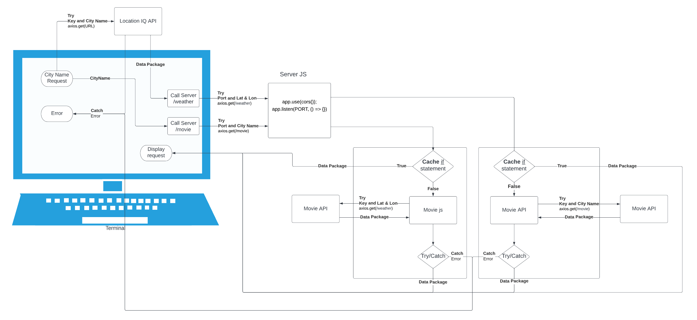

# City Explorer

**Author**: Francisco
**Version**: 2.0.0

## Overview

One of two Parts for City Explorer. This code base is for the Front-End aspect of City Explorer, an application that allows a user to search a city by name to receive the 16 day weather forecast and any movie with the city name in its title. This application utilizes React and Bootstrap to implement front end render Front-End elements.

## Getting Started

To get this application started in your own machines, you must first get API Keys to [LocationIQ API](https://locationiq.com/), [The Movie Data Base API](https://www.themoviedb.org/documentation/api?language=en-US), and [Weatherbit API](https://www.weatherbit.io/).

Once you have those three API Keys, clone this repository to a local storage. Also clone [City Explorer API gitHub](https://github.com/c0d3cisco/city-explorer-api) locally in a separation folder.

Locally, generate an .env file for the City-Explorer and City-Explorer-API repo. Use the template .env.sample file to populate the correct information. Utilize local port 3001 for the City-Explorer-API repo if possible.

Within the City-Explorer repo in the terminal, run `npm start`. This will initiate your Front-End.

Within the City-Explorer-API repo in the terminal, run `nodemon`. This will initiate your Back-End

Application should be ready to use!

## Architecture

This application utilizes React and Bootstrap to implement front end render Front-End elements. The Axios library is used to retrieve data from the Location IQ API as well as the second part of this application, [City Explorer API gitHub](https://github.com/c0d3cisco/city-explorer-api).

Below is a diagram of the Web Request/Response Cycle flow that makes up this application.

## Credit and Collaborations

[React Bootstrap Elements](https://react-bootstrap.github.io/)
[LocationIQ API](https://locationiq.com/) *used by City Explorer API
[The Movie Data Base API](https://www.themoviedb.org/documentation/api?language=en-US)*used by City Explorer API
[Weatherbit API](https://www.weatherbit.io/)
[Axios Library](https://www.npmjs.com/package/axios#installing)
[Nodemon Library](https://www.npmjs.com/package/nodemon)

## Feature 1

Name of feature: Connection to LocationIQ API

Estimate of time needed to complete: 60min

Start time: 3:50pm

Finish time: 5:24pm

Actual time needed to complete: 94min

## Feature 2

Name of feature: Integration of Map

Estimate of time needed to complete: 60min

Start time: 7:15pm

Finish time: 8:20pm

Actual time needed to complete: 65min

## Feature 3

Name of feature: Error Handling

Estimate of time needed to complete: 60min

Start time: 8:30pm

Finish time: 9:20pm

Actual time needed to complete: 50min

## Feature 4

Name of feature: Connection to Live Server

Estimate of time needed to complete: 30min

Start time: 8:20am

Finish time: 9:47am

Actual time needed to complete: 50min
